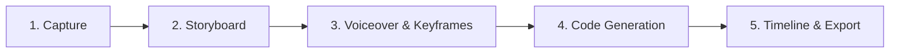
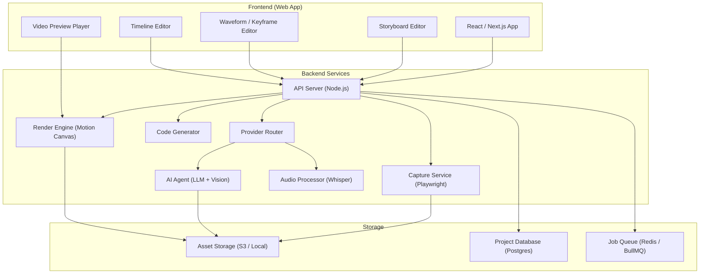

# VDOMake — Product Document

**AI-Powered Website-to-Video Platform**
*Turn any website into a polished, animated video — without After Effects.*

---

## 1. Problem Statement

Creating smooth, professional animated videos of websites (tutorials, product demos, landing page showcases) is painfully manual today:

| Step | Current Pain |
|---|---|
| **Screenshots** | Manually capturing dozens of screens, exporting as PDF for crisp resolution |
| **Design Matching** | Recreating the website's color palette, typography, and spacing in a motion tool |
| **Animation** | Hand-keyframing every transition, scroll, and highlight in After Effects |
| **Voiceover Sync** | Manually aligning audio narration to visual keyframes frame-by-frame |
| **Iteration** | Any script or design change means re-doing most of the above |

A 60-second website walkthrough can easily take **4–8 hours** of skilled motion design work. VDOMake compresses this to **minutes**.

---

## 2. Vision

> **One URL in → polished animated video out.**

VDOMake is an AI-powered platform where you paste a URL, an agent captures and understands the site, generates a storyboard you can refine, syncs your voiceover, and produces a production-ready animated video — all powered by code-based video generation (Motion Canvas / Remotion).

---

## 3. Core Workflow

The user experience follows a **5-phase pipeline**, each phase producing an artifact the user can review and adjust before moving forward.

### Phase 1 — Capture & Analyze

**Input:** A web URL (public or localhost)

**What happens:**
- A headless browser (Puppeteer / Playwright) navigates the target site.
- The agent captures **full-page, high-DPI screenshots** of every key view/state (hero section, scroll positions, hover states, modals, navigation targets).
- Screenshots are taken at configurable viewport sizes (desktop, tablet, mobile).
- The AI analyzes the site and extracts a **theme profile**:
  - Color palette (primary, secondary, accent, background, text)
  - Typography (font families, weights, sizes, line heights)
  - Spacing & layout rhythm
  - Border radii, shadow styles, glassmorphism / gradients
  - Brand assets (logo, favicon, OG images)

**Output:**
- A set of high-resolution screenshots (PNG / WebP)
- A structured **theme manifest** (JSON) describing the site's visual DNA

---

### Phase 2 — AI Storyboard Generation

**Input:** Captured screenshots + theme manifest

**What happens:**
- The AI composes a **storyboard** — an ordered sequence of scenes, each with:
  - A screenshot or AI-generated stylized frame
  - A suggested transition type (fade, slide, zoom, morph, scroll-reveal)
  - Suggested duration
  - Text overlays / callouts (auto-detected from page content)
  - Camera movements (pan, zoom-to-element, ken burns)
- The AI uses the theme manifest to ensure all generated visual elements (backgrounds, text, highlights, callout boxes) match the website's design language.
- Optionally, the AI generates **enhanced frames** — stylized or annotated versions of the screenshots for a more polished look (e.g., device mockups, gradient backgrounds, floating UI elements).

**Output:**
- A visual **storyboard grid** the user can review
- Each scene is editable:
  - Reorder scenes (drag & drop)
  - Add / remove scenes
  - Change transition type and duration
  - Edit text overlays
  - Swap screenshots or upload custom frames
  - Adjust camera/zoom targets

> [!TIP]
> The storyboard is the creative control surface. The user shapes the narrative here before any video is generated.

---

### Phase 3 — Voiceover & Keyframe Tagging

**Input:** Finalized storyboard + uploaded voiceover audio

**What happens:**
- The user uploads a **voiceover recording** (MP3 / WAV).
- The AI performs **automatic speech segmentation**:
  - Transcribes the audio (Whisper or similar)
  - Detects natural sentence / paragraph boundaries
  - Identifies pauses and emphasis points
- The platform presents a **waveform + transcript view** where the user can:
  - **Tag keyframes** — mark where each scene starts/ends in the audio
  - **Set transition timing** — define how long each transition should take
  - **Auto-suggest mode** — AI proposes keyframe placements based on transcript content matched to storyboard scenes
- The system calculates per-scene durations and adjusts the storyboard timing accordingly.

**Output:**
- A **timing map**: each storyboard scene linked to a time range in the audio
- Transition durations locked in

> [!IMPORTANT]
> The keyframe tagging step is what makes the final video feel *synced* and intentional rather than robotic. This is the critical human-in-the-loop moment.

---

### Phase 4 — Code Generation (Motion Canvas / Remotion)

**Input:** Timed storyboard + voiceover + theme manifest

**What happens:**
- The AI generates **Motion Canvas** (or Remotion) source code that:
  - Imports all screenshots/frames as assets
  - Applies the correct transitions between scenes at the tagged timestamps
  - Renders text overlays with the site's actual fonts and colors
  - Applies camera movements (zoom, pan) as specified
  - Embeds the voiceover audio track, perfectly synced
  - Uses the theme manifest for any procedurally-generated elements (backgrounds, highlight boxes, progress bars)
- The generated code is **fully editable** — power users can tweak animations, easing curves, or add custom effects.

**Output:**
- A complete Motion Canvas / Remotion project
- Auto-rendered preview of the video

> [!NOTE]
> By generating code rather than a binary video file, the output is **version-controllable, parameterizable, and infinitely tweakable**. This is a key differentiator from screen-recording tools.

---

### Phase 5 — Timeline Editor & Export

**Input:** Generated video project

**What happens:**
- The platform presents a **visual timeline editor** showing:
  - Video track (scene thumbnails on a timeline)
  - Audio track (waveform)
  - Transition markers
  - Text overlay timing
  - Keyframe indicators
- The user can make **final adjustments**:
  - Trim or extend scenes
  - Fine-tune transition timing
  - Adjust text overlay appearance/timing
  - Add background music track
  - Change playback speed for specific sections
- **Live preview** plays the video in real-time as edits are made.
- Once satisfied, the user **exports** the final video:
  - Resolution: 720p / 1080p / 4K
  - Format: MP4 (H.264), WebM
  - Frame rate: 30fps / 60fps

**Output:**
- Production-ready video file
- Optionally: the Motion Canvas project files (downloadable as `.zip`) for further editing outside VDOMake

---

## 4. Feature Breakdown

### 4.1 Web Capture Engine

| Feature | Description |
|---|---|
| URL Input | Supports public URLs, localhost, and authenticated sites (via cookie/session injection) |
| Smart Scrolling | Automatically scrolls the page and captures at key breakpoints |
| Interaction Capture | Captures hover states, dropdown menus, modals, tab switches |
| Multi-Viewport | Simultaneous capture at desktop (1440px), tablet (768px), mobile (375px) |
| SPA Support | Handles single-page apps with route-based navigation |
| High-DPI | 2x / 3x retina screenshots for crisp video output |

### 4.2 Theme Intelligence

| Feature | Description |
|---|---|
| Color Extraction | Pulls exact hex/HSL values from computed styles |
| Typography Detection | Identifies Google Fonts, system fonts, custom typefaces |
| Layout Analysis | Understands grid systems, section boundaries, visual hierarchy |
| Brand Asset Extraction | Captures logos, favicons, OG images |
| Theme JSON Export | Structured manifest usable across the entire pipeline |

### 4.3 Storyboard Editor

| Feature | Description |
|---|---|
| AI Scene Generation | Automatically proposes scene order and transitions |
| Drag & Drop Reorder | Rearrange scenes visually |
| Scene Templates | Pre-built scene types (intro, feature highlight, CTA, outro) |
| Custom Frame Upload | Replace AI frames with custom screenshots or designs |
| Annotation Tools | Add arrows, highlights, blur regions, zoom indicators |
| Device Mockups | Wrap screenshots in browser/phone/tablet frames |

### 4.4 Audio & Keyframe System

| Feature | Description |
|---|---|
| Audio Upload | MP3, WAV, M4A support |
| AI Transcription | Automatic speech-to-text with timestamps |
| Waveform Editor | Visual waveform with playback scrubbing |
| Keyframe Markers | Draggable markers to tag scene boundaries on the waveform |
| Auto-Sync | AI suggests keyframe placements based on transcript ↔ storyboard matching |
| Pause Detection | Automatically finds natural pause points for transitions |

### 4.5 Video Code Generation

| Feature | Description |
|---|---|
| Motion Canvas Output | Generates TypeScript project with scenes, transitions, and audio |
| Remotion Output | Alternative React-based video generation |
| Transition Library | Fade, slide, zoom, morph, wipe, dissolve, parallax scroll |
| Easing Presets | Smooth, spring, bounce, linear — per transition |
| Text Animation | Typewriter, fade-in, slide-up for overlays and captions |
| Code Preview | Syntax-highlighted, editable code view |

### 4.6 Timeline & Export

| Feature | Description |
|---|---|
| Multi-Track Timeline | Video, voiceover, background music, text, and transition tracks |
| Real-Time Preview | Instant playback of the composed video |
| Fine-Tune Controls | Per-frame timing adjustments |
| Background Music | Add and mix a background audio track with automatic volume ducking during voiceover |
| Export Presets | YouTube (1080p/60fps), Twitter (720p), Instagram (1080×1080), Custom |
| Batch Export | Export multiple resolutions simultaneously |
| Project Download | Download the generated Motion Canvas project as a `.zip` for editing outside VDOMake |

### 4.7 AI Provider Management

VDOMake is **provider-agnostic**. Users bring their own API keys and choose which AI provider powers each part of the pipeline.

| Feature | Description |
|---|---|
| Multi-Provider Support | OpenAI, Anthropic (Claude), Google Gemini, and open-source/local models |
| API Key Management | Secure settings page to add, validate, and manage API keys per provider |
| Per-Task Provider Selection | Choose which provider handles each AI task (vision analysis, storyboard gen, transcription, auto-sync) |
| Key Validation | Real-time validation that entered keys are active and have sufficient permissions |
| Usage Tracking | Per-project token/cost usage dashboard showing spend per provider |
| Fallback Chain | Configure fallback providers — if primary fails, automatically try the next |
| Local / Self-Hosted | Support for Ollama, LM Studio, and other local inference servers via OpenAI-compatible API |
| Encrypted Storage | API keys encrypted at rest, never logged, never sent to VDOMake servers |

**Supported Providers:**

| Provider | Capabilities Used |
|---|---|
| **OpenAI** (GPT-4o, GPT-4o-mini) | Vision analysis, storyboard generation, code review |
| **OpenAI Whisper** | Audio transcription with word-level timestamps |
| **Anthropic** (Claude 4, Claude 4 Sonnet) | Storyboard narration, scene descriptions, auto-sync |
| **Google Gemini** (Gemini 2.5 Pro/Flash) | Vision analysis, theme extraction, storyboard generation |
| **Open-Source / Local** (Ollama, LM Studio) | Privacy-first option, any OpenAI-compatible endpoint |

> [!TIP]
> Users only need **one** provider to get started. The settings page highlights the minimum required capabilities (vision model + text model) and recommends the best provider for each task.

### 4.8 Developer Experience & Infrastructure

| Feature | Description |
|---|---|
| Docker Compose | One-command local setup for PostgreSQL + Redis via `docker compose up -d` |
| Environment Template | `.env.example` with all required variables (DB, Redis, encryption, storage) |
| Structured Logging | Pino-based logging with structured context (`projectId`, `phase`, `jobId`) |
| API Error Standards | Consistent error responses (`{ error, code, message }`) across all API routes |
| Input Validation | Zod schemas shared between frontend forms and backend API routes |
| Real-Time Progress | Server-Sent Events (SSE) for streaming capture, render, and export progress |
| Error Boundaries | React Error Boundaries at root and project level with user-friendly recovery UI |
| Pre-Commit Hooks | Husky + lint-staged runs ESLint + Prettier on every commit |

---

## 5. Technical Architecture (High-Level)

### Key Technology Choices

| Layer | Technology | Rationale |
|---|---|---|
| **Web Capture** | Playwright | Headless Chromium, supports auth, SPA, multi-viewport |
| **AI Provider Router** | Custom abstraction layer | Unified interface across OpenAI, Anthropic, Gemini, local models |
| **AI / Vision** | OpenAI GPT-4o, Anthropic Claude, Gemini 2.5 Pro | User's choice — page analysis, storyboard gen, code review |
| **Audio Processing** | OpenAI Whisper (or local whisper.cpp) | Speech transcription, user can choose API or local |
| **Video Generation** | Motion Canvas | TypeScript-based, programmatic, open-source, high quality |
| **Video Generation (Alt)** | Remotion | React-based alternative, strong ecosystem |
| **Video Encoding** | FFmpeg (via fluent-ffmpeg) | Industry-standard encoder: image sequence → MP4 (H.264) / WebM |
| **Frontend** | Next.js + React | SSR, API routes, rich component ecosystem |
| **Real-Time Updates** | Server-Sent Events (SSE) | Streaming capture/render/export progress to UI |
| **Queue / Jobs** | BullMQ + Redis | Async rendering jobs, progress tracking |
| **Database** | PostgreSQL + Drizzle ORM | Projects, storyboards, user data, encrypted API keys |
| **Validation** | Zod | Shared schemas for API input validation + form validation |
| **Logging** | Pino | Structured JSON logging with context |
| **Storage** | S3-compatible | Screenshots, audio, rendered videos |

---

## 6. User Personas

### 🎯 Primary: Content Creator / YouTuber
- Makes website reviews, tool comparisons, SaaS tutorials
- Currently uses screen recording + After Effects
- Wants polished output without motion design skills

### 🎯 Secondary: Product / Marketing Team
- Needs demo videos for landing pages, Product Hunt launches, investor decks
- Wants on-brand videos that match their website's design system
- Needs fast iteration when the product UI changes

### 🎯 Tertiary: Developer / Designer
- Wants to showcase a portfolio project or open-source tool
- Appreciates the code-based output (can extend/customize)
- Values localhost support for pre-launch content

---

## 7. MVP Scope

For the initial release, focus on the **critical path** that delivers the core value:

| Phase | MVP Scope | Post-MVP |
|---|---|---|
| **Capture** | Single URL, desktop viewport, full-page scroll capture | Multi-viewport, interaction capture, SPA routing, authenticated sites (cookie injection) |
| **Theme** | Color palette + font extraction | Full layout analysis, brand asset extraction |
| **Storyboard** | AI-generated scene sequence, basic reorder/edit | Templates, device mockups, annotations |
| **Audio** | Upload audio, manual keyframe tagging | AI auto-sync, pause detection |
| **Code Gen** | Motion Canvas output with fade/slide transitions | Full transition library, easing presets, Remotion support |
| **Timeline** | Basic timeline view with scene thumbnails | Multi-track, background music, fine-tune controls |
| **Export** | 1080p MP4 export | Multi-resolution, batch export, format options, project download |

> [!IMPORTANT]
> The MVP should be end-to-end functional: **URL → Storyboard → Voiceover Sync → Video Export**. Every phase must work, even if limited in options.

---

## 8. Competitive Landscape

| Tool | What It Does | Where VDOMake Wins |
|---|---|---|
| **Loom / Screen Studio** | Screen recording with polish | VDOMake produces *animated* videos, not recordings. Higher production value. |
| **After Effects** | Full motion design | VDOMake automates 90% of the work. No motion design skills needed. |
| **Remotion / Motion Canvas** | Code-based video | VDOMake adds the AI layer — you don't write the code yourself. |
| **Descript** | Audio-first video editing | VDOMake is website-first. Purpose-built for web content. |
| **Beautiful.ai / Gamma** | AI presentations | Static slides, not animated video. |

**VDOMake's unique position:** It's the only tool that combines **web-aware capture**, **design-aware AI**, and **code-based video generation** into a single workflow.

---

## 9. Future Possibilities

- **Live Interaction Recording** — Record actual user interactions (clicks, scrolls) and replay them as smooth animations
- **Template Marketplace** — Community-shared storyboard templates and transition packs
- **API / CLI** — Programmatic video generation for CI/CD pipelines (auto-generate demo videos on every deploy)
- **Multi-Page Flows** — Stitch together multi-page user journeys (signup flow, checkout flow)
- **AI Voiceover Generation** — Generate narration from a script using TTS, eliminating the need to record audio
- **Collaboration** — Multi-user editing, comments, version history
- **Plugin System** — Custom transition effects, post-processing filters, branding presets

---

## 10. Success Metrics

| Metric | Target |
|---|---|
| Time from URL → exported video | < 15 minutes (vs. 4–8 hours manually) |
| User satisfaction with output quality | ≥ 4.2 / 5 star rating |
| Storyboard acceptance rate (AI suggestions kept) | ≥ 70% of scenes |
| Export completion rate | ≥ 85% of started projects |

---

## 11. Name & Positioning

**VDOMake** — *"Make videos from the DOM."*

- **Tagline**: *"Paste a URL. Get a video."*
- **Positioning**: The AI-powered video studio for the web. Turn any website into a polished animated video in minutes, not hours.

---

> [!NOTE]
> This document is a living artifact. As technical spikes and prototyping uncover constraints, the scope and architecture will evolve accordingly.
